# Support des formats d'images dans le Web

## 1. Introduction

Ce rapport présente un inventaire complet des formats d'images supportés dans les navigateurs web, depuis les débuts du World Wide Web (1990) jusqu'à aujourd'hui. Pour chaque format, nous documentons les versions minimales de support avec des références vérifiables.

**Méthodologie** : Les données sont collectées depuis Can I Use, MDN Web Docs, les documentations officielles des navigateurs, Wikipedia et les archives du W3C.

### Les premiers formats d'images sur le Web

**1992 : GIF - Le tout premier format**
- GIF devient le premier format d'image utilisé sur le Web
- Juillet 1992 : Tim Berners-Lee développe le support GIF
- Première photo sur le Web : le groupe "Les Horribles Cernettes" (format GIF)

**1993 : L'arrivée de Mosaic**
- Mars 1993 : NCSA Mosaic 0.10 introduit la balise ``
- Support inline pour XBM (X Bitmap) et GIF

**1994 : JPEG rejoint le Web**
- Décembre 1994 : Netscape Navigator 1.0 introduit le support JPEG
- 2 ans après la standardisation de JPEG (1992)

**1996-1997 : PNG fait son apparition**
- Octobre 1996 : PNG standardisé par le W3C
- 1997 : Premiers supports dans IE 4.0 et Netscape 4.04
- Adoption très lente à cause des problèmes de transparence dans IE

## 2. Tableaux récapitulatifs de compatibilité

### 2.1 Navigateurs modernes (2008-2025)

| Format | Chrome | Firefox | Safari | Edge | Opera | IE 11 | Chrome Android | Safari iOS | Samsung Internet |
|--------|--------|---------|--------|------|-------|-------|----------------|------------|------------------|
| JPEG | 1.0 | 1.0 | 1.0 | 12 | 3.5 | ✓ | 18 | 1.0 | 1.0 |
| PNG | 1.0 | 1.0 | 1.0 | 12 | 3.5 | ✓ | 18 | 1.0 | 1.0 |
| GIF | 1.0 | 1.0 | 1.0 | 12 | 3.5 | ✓ | 18 | 1.0 | 1.0 |
| BMP | 1.0 | 1.0 | 1.0 | 12 | 3.5 | ✓ | 18 | 1.0 | 1.0 |
| ICO | 1.0 | 1.0 | 1.0 | 12 | 3.5 | ✓ | 18 | 1.0 | 1.0 |
| SVG | 4.0 | 3.0 | 3.2 | 12 | 9.0 | Partiel | 18 | 3.2 | 4.0 |
| WebP | 32* | 65 | 14.0 | 18 | 19** | ❌ | 32 | 14.0 | 4.0 |
| APNG | 59 | 3.0 | 8.0 | 79*** | 46 | ❌ | 59 | 8.0 | 7.2 |
| AVIF | 85 | 93 | 16.0 | 121 | 71 | ❌ | 85 | 16.0 | 14.0 |
| JPEG 2000 | ❌ | ❌ | 5.0-17.6**** | ❌ | ❌ | ❌ | ❌ | 5.0-17.7**** | ❌ |
| JPEG XL | ❌***** | ❌***** | 17.0+ | ❌ | ❌ | ❌ | ❌ | ❌ | ❌ |
| TIFF | ❌ | ❌ | ✓****** | ❌ | ❌ | ❌ | ❌ | ✓****** | ❌ |
| HEIC | ❌ | ❌ | 17.6+******* | ❌ | ❌ | ❌ | ❌ | 17.6+******* | ❌ |

*\* Chrome 9 avait un support partiel, Chrome 32 (janvier 2014) pour le support complet*
*\*\* Opera 11.5 pour support initial, Opera 19 pour support complet*
*\*\*\* Edge 79 (Chromium), pas Edge 12 (EdgeHTML)*
*\*\*\*\* Supporté via QuickTime de 2010-2011 à septembre 2024, puis retiré dans Safari 18/iOS 18*
*\*\*\*\*\* Support expérimental via flag. Google annonce le retour du support fin 2025*
*\*\*\*\*\*\* Support via QuickTime (macOS/iOS uniquement)*
*\*\*\*\*\*\*\* Safari 17.6+ supporte HEIF/HEIC nativement*

### 2.2 Navigateurs historiques (1993-2008)

| Format | Mosaic | Netscape 1.0 | Netscape 2.0 | Netscape 4.04 | IE 3.0 | IE 4.0 | IE 5.0 | IE 6.0 | IE 7.0 |
|--------|--------|--------------|--------------|---------------|--------|--------|--------|--------|--------|
| **Année** | 1993 | 1994 | 1995 | 1997 | 1996 | 1997 | 1999 | 2001 | 2006 |
| GIF (statique) | ✓ | ✓ | ✓ | ✓ | ✓ | ✓ | ✓ | ✓ | ✓ |
| GIF (animé) | ❌ | ❌ | ✓ | ✓ | ❌ | ✓ | ✓ | ✓ | ✓ |
| JPEG (baseline) | ✓* | ✓ | ✓ | ✓ | ✓ | ✓ | ✓ | ✓ | ✓ |
| JPEG (progressif) | ❌ | ❌ | ✓ | ✓ | ❌ | ✓ | ✓ | ✓ | ✓ |
| PNG (basique) | ✓** | ❌ | ❌ | ✓*** | ❌ | ✓*** | ✓*** | ✓*** | ✓ |
| PNG (transparence) | ❌ | ❌ | ❌ | ❌ | ❌ | ❌ | ❌**** | ❌**** | ✓ |
| XBM | ✓ | ✓ | ✓ | ✓ | ? | ? | ? | ? | ? |
| BMP | ? | ❌ | ❌ | ❌ | ? | ✓ | ✓ | ✓ | ✓ |

*\* Mosaic : JPEG supporté pour visualisation externe dès version 0.9, inline à partir de 2.0.1 (1995)*
*\*\* Mosaic : PNG ajouté dans les dernières versions (1997)*
*\*\*\* PNG supporté mais sans transparence alpha*
*\*\*\*\* IE 5.5 (2000) a introduit le filtre AlphaImageLoader comme workaround*

### 2.3 Opera historique (1996-2010)

| Format | Opera 2.0 (1996) | Opera 6.0 (2001) | Opera 8.0 (2005) | Opera 9.0 (2006) |
|--------|------------------|------------------|------------------|------------------|
| GIF | ✓ | ✓ | ✓ | ✓ |
| JPEG | ✓ | ✓ | ✓ | ✓ |
| PNG (basique) | ✓ | ✓ | ✓ | ✓ |
| PNG (alpha) | ❌ | ✓ | ✓ | ✓ |
| SVG | ❌ | ❌ | ✓* | ✓** |

*\* SVG 1.1 Tiny*
*\*\* SVG 1.1 Basic*

## 3. Timeline de l'adoption des formats

```mermaid
timeline
    title Évolution du support des formats d'images web (1992-2025)

    section Début du Web (1990-1993)
        1990 : WorldWideWeb (Tim Berners-Lee)
             : Premier navigateur graphique
        1992 : GIF - Premier format image web
             : Photo "Les Horribles Cernettes"
        1993 : Mosaic 0.10 - Tag IMG
             : Support XBM et GIF inline
             : JPEG (externe uniquement)

    section Ère Netscape/IE (1994-1997)
        1994 : Netscape 1.0 - JPEG inline
             : GIF87a (statique)
        1995 : Netscape 2.0 - GIF animé
             : JPEG progressif
             : Mosaic 2.0.1 - JPEG inline
        1996 : IE 3.0 - GIF et JPEG
             : PNG standardisé (W3C)
             : Opera 2.0 lancé
        1997 : IE 4.0 - PNG sans transparence
             : Netscape 4.04 - PNG sans transparence
             : Mosaic abandonné

    section Guerre des navigateurs (1998-2006)
        1999 : IE 5.0 domine le marché
        2000 : IE 5.5 - Filtre PNG (workaround)
        2001 : IE 6.0 - Toujours pas de PNG alpha
             : Opera 6.0 - PNG alpha natif
        2004 : Firefox 1.0 - Support complet
        2005 : Opera 8.0 - Premier SVG (Tiny)
        2006 : IE 7.0 - ENFIN PNG alpha natif
             : Opera 9.0 - SVG 1.1 Basic

    section Ère moderne (2008-2014)
        2008 : Chrome 1.0 lancé
             : Firefox 3.0 - APNG
             : Safari 3.2 - SVG
        2010 : Chrome 4 - SVG
             : Google annonce WebP
             : Safari 5.0 - JPEG 2000
        2011 : Firefox 4.0 - SVG complet
             : Chrome 9 - WebP partiel
             : Opera 11.5 - WebP
        2012 : Edge 12 (EdgeHTML)
        2014 : Chrome 32 - WebP complet
             : Safari 8.0 - APNG
             : Safari 9.0 - SVG amélioré

    section Formats next-gen (2017-2020)
        2017 : Chrome 59 - APNG
             : Opera 46 - APNG
        2018 : Edge 18 - WebP
             : Samsung Internet 7 - APNG
        2019 : Firefox 65 - WebP
        2020 : Safari 14 - WebP enfin
             : Chrome 85 - AVIF
             : Opera 71 - AVIF
             : Edge 79 - Chromium (APNG)

    section Dernières évolutions (2021-2025)
        2021 : Firefox 93 - AVIF
             : Samsung Internet 14 - AVIF
        2022 : Safari 16.0 - AVIF
             : Chrome retire JPEG XL
        2024 : Edge 121 - AVIF
             : Safari 18 - Retire JPEG 2000
             : Safari 17.6 - Ajoute HEIC
        2025 : Google annonce retour JPEG XL
```



## 4. Détails par format

### 4.1 Formats classiques

#### JPEG (Joint Photographic Experts Group)

**Description** : Format de compression avec perte optimisé pour les photographies.

**Histoire** :
- **1992** : Standard JPEG publié
- **1993** : JPEG supporté dans Mosaic (visualisation externe)
- **1994** : Netscape Navigator 1.0 - Premier support JPEG inline
- **1995** : JPEG progressif dans Netscape 2.0 et Mosaic 2.0.1

**Support navigateurs historiques** :
- **Mosaic** : Version 0.9 (1993, externe), 2.0.1 (1995, inline)
- **Netscape Navigator** : Version 1.0 (décembre 1994)
- **Internet Explorer** : Version 3.0 (août 1996)
- **Opera** : Version 2.0 (avril 1996)

**Support navigateurs modernes** :
- **Chrome** : Depuis version 1.0 (septembre 2008)
- **Firefox** : Depuis version 1.0 (novembre 2004)
- **Safari** : Depuis version 1.0 (juin 2003)
- **Edge** : Depuis version 12 (juillet 2015)
- **Opera** : Depuis version 3.5 (2000)
- **IE 11** : Supporté (octobre 2013)
- **Chrome Android** : Depuis version 18 (2012)
- **Safari iOS** : Depuis version 1.0 (juin 2007)
- **Samsung Internet** : Depuis version 1.0 (2012)

**Références** :
- [MDN - JPEG](https://developer.mozilla.org/en-US/docs/Web/Media/Formats/Image_types#jpeg)
- [JPEG History - IEEE Spectrum](https://spectrum.ieee.org/jpeg-image-format-history)

---

#### PNG (Portable Network Graphics)

**Description** : Format de compression sans perte avec support de la transparence alpha. Créé comme alternative libre à GIF (problèmes de brevets LZW).

**Histoire** :
- **Octobre 1996** : PNG 1.0 approuvé par le W3C
- **Janvier 1997** : Publié comme RFC 2083
- **1997** : Premier support (IE 4.0, Netscape 4.04) sans transparence
- **2000** : IE 5.5 introduit le filtre AlphaImageLoader (workaround)
- **2001** : Opera 6.0 - Premier support natif de la transparence alpha
- **2006** : IE 7.0 - Enfin le support natif de la transparence alpha

**Le problème historique de PNG** : L'absence de support de la transparence alpha dans Internet Explorer (versions 4 à 6, soit 1997-2006) a gravement freiné l'adoption de PNG pendant près d'une décennie. Les développeurs web devaient utiliser des hacks JavaScript/CSS ou éviter PNG.

**Support navigateurs historiques** :
- **Mosaic** : Dernières versions (1997, avant arrêt)
- **Netscape Navigator** : Version 4.04 (novembre 1997, sans transparence)
- **Internet Explorer** :
  - Version 4.0 (septembre 1997, sans transparence)
  - Version 7.0 (octobre 2006, avec transparence alpha native)
- **Opera** :
  - Version 2.0 ou 3.0 (1996-1999, support basique probable)
  - Version 6.0 (novembre 2001, transparence alpha)

**Support navigateurs modernes** :
- **Chrome** : Depuis version 1.0 (2008)
- **Firefox** : Depuis version 1.0 (2004)
- **Safari** : Depuis version 1.0 (2003)
- **Edge** : Depuis version 12 (2015)
- **Opera** : Depuis version 3.5 (2000)
- **IE 11** : Supporté avec transparence (2013)
- **Chrome Android** : Depuis version 18 (2012)
- **Safari iOS** : Depuis version 1.0 (2007)
- **Samsung Internet** : Depuis version 1.0 (2012)

**Références** :
- [MDN - PNG](https://developer.mozilla.org/en-US/docs/Web/Media/Formats/Image_types#png)
- [Can I Use - PNG Alpha](https://caniuse.com/png-alpha)
- [PNG History](http://www.libpng.org/pub/png/pnghist.html)
- [PNG: The Definitive Guide](https://www.oreilly.com/library/view/png-the-definitive/9781565925427/)

---

#### GIF (Graphics Interchange Format)

**Description** : Format supportant les animations et la transparence binaire (on/off). Premier format d'image du Web.

**Histoire** :
- **1987** : Format GIF créé par CompuServe
- **1989** : GIF89a ajoute le support des animations
- **Juillet 1992** : Premier format d'image utilisé sur le Web (Tim Berners-Lee)
- **Mars 1993** : Mosaic 0.10 - Support inline avec tag ``
- **Septembre 1995** : Netscape 2.0 - Premier navigateur à supporter les GIF animés

**La controverse GIF** : Les brevets LZW (détenus par Unisys jusqu'en 2003) ont créé des controverses et motivé la création de PNG comme alternative libre.

**Support navigateurs historiques** :
- **Mosaic** : Version 0.10 (mars 1993)
  - GIF statique et animé : GIF animé non supporté
- **Netscape Navigator** :
  - Version 1.0 (décembre 1994) : GIF87a statique
  - Version 2.0 (septembre 1995) : GIF89a animé - PREMIER support d'animations
- **Internet Explorer** :
  - Version 3.0 (août 1996) : Support confirmé
  - Version 4.0+ : Support des GIF animés
- **Opera** : Version 2.0 (avril 1996)

**Support navigateurs modernes** : Universel depuis toujours

**Références** :
- [MDN - GIF](https://developer.mozilla.org/en-US/docs/Web/Media/Formats/Image_types#gif)
- [First Photo on Internet](https://logicmatters.in/first-photo-on-internet-story/)
- [Netscape 2.0 - Web Design Museum](https://www.webdesignmuseum.org/software/netscape-navigator-2-0-in-1995)

---

#### BMP (Bitmap)

**Description** : Format bitmap non compressé de Microsoft, principalement utilisé sur Windows.

**Support navigateurs** :
- Support natif dans tous les navigateurs modernes depuis leurs premières versions
- Probablement supporté dans IE depuis les premières versions (format natif Windows)

**Références** :
- [MDN - BMP](https://developer.mozilla.org/en-US/docs/Web/Media/Formats/Image_types#bmp)

---

#### ICO (Icon)

**Description** : Format d'icônes Windows, principalement utilisé pour les favicons.

**Support navigateurs** : Universel, surtout pour les favicons (`<link rel="icon">`)

**Références** :
- [MDN - ICO](https://developer.mozilla.org/en-US/docs/Web/Media/Formats/Image_types#ico)

---

### 4.2 Formats vectoriels

#### SVG (Scalable Vector Graphics)

**Description** : Format d'image vectorielle basé sur XML, permettant un redimensionnement sans perte de qualité.

**Histoire** :
- **2001** : SVG 1.0 devient recommandation W3C (4 septembre 2001)
- **2003** : SVG 1.1 recommandation W3C
- **2005** : Opera 8.0 - Premier navigateur majeur avec SVG (SVG Tiny 1.1)
- **2006** : Opera 9.0 - SVG 1.1 Basic
- **2008** : Firefox 3.0 et Safari 3.2 - Support SVG
- **2010** : Chrome 4.0 - Support SVG
- **2011** : Firefox 4.0 - Support SVG complet

**Support navigateurs historiques** :
- **Opera** :
  - Version 8.0 (avril 2005) : SVG 1.1 Tiny - PREMIER support majeur
  - Version 9.0 (juin 2006) : SVG 1.1 Basic

**Support navigateurs modernes** :
- **Chrome** : Depuis version 4 (janvier 2010)
- **Firefox** : Depuis version 3.0 (juin 2008)
- **Safari** : Depuis version 3.2 (novembre 2008)
- **Edge** : Depuis version 12 (juillet 2015)
- **Opera** : Depuis version 9.0 (juin 2006)
- **IE 11** : Support partiel (2013)
- **Chrome Android** : Depuis version 18 (2012)
- **Safari iOS** : Depuis version 3.2 (2008)
- **Samsung Internet** : Depuis version 4.0 (février-avril 2016)

**Références** :
- [Can I Use - SVG](https://caniuse.com/svg)
- [MDN - SVG](https://developer.mozilla.org/en-US/docs/Web/Media/Formats/Image_types#svg)
- [Opera 8.0 History](https://en.wikipedia.org/wiki/History_of_the_Opera_web_browser)

---

### 4.3 Formats modernes

#### WebP

**Description** : Format développé par Google offrant une compression avec et sans perte, plus efficace que JPEG et PNG.

**Histoire** :
- **Septembre 2010** : Google annonce WebP
- **Février 2011** : Chrome 9 - Support partiel
- **Juin 2011** : Opera 11.5 - Support initial
- **Janvier 2014** : Chrome 32 - Support complet
- **Octobre 2018** : Edge 18 - Support
- **Janvier 2019** : Firefox 65 - Support (après 8 ans de résistance)
- **Septembre 2020** : Safari 14 - Support (après 10 ans !)

**L'adoption lente de WebP** : Malgré ses avantages techniques, WebP a mis 9 ans (2011-2020) pour être universellement supporté, principalement à cause de la résistance d'Apple et Mozilla.

**Support navigateurs** :
- **Chrome** : Version 32 (janvier 2014, support complet) - Version 9 (février 2011, partiel)
- **Firefox** : Depuis version 65 (29 janvier 2019)
- **Safari** : Depuis version 14.0 (16 septembre 2020)
- **Edge** : Depuis version 18 (2 octobre 2018)
- **Opera** : Version 19 (support complet) - Version 11.5 (28 juin 2011, initial)
- **IE 11** : Non supporté
- **Chrome Android** : Depuis version 32 (2014)
- **Safari iOS** : Depuis version 14.0 (16 septembre 2020)
- **Samsung Internet** : Depuis version 4.0 (février-avril 2016)

**Références** :
- [Can I Use - WebP](https://caniuse.com/webp)
- [Google Developers - WebP](https://developers.google.com/speed/webp)
- [WebP FAQ](https://developers.google.com/speed/webp/faq)

---

#### AVIF (AV1 Image File Format)

**Description** : Format moderne basé sur le codec vidéo AV1, offrant une compression supérieure à WebP.

**Histoire** :
- **Février 2019** : Spécification AVIF 1.0.0 publiée
- **Août 2020** : Chrome 85 et Opera 71 - Premiers supports
- **Octobre 2021** : Firefox 93 - Support
- **Septembre 2022** : Safari 16.0 - Support
- **Janvier 2024** : Edge 121 - Support

**Support navigateurs** :
- **Chrome** : Depuis version 85 (25 août 2020)
- **Firefox** : Depuis version 93 (5 octobre 2021)
- **Safari** : Depuis version 16.0 (12 septembre 2022)
- **Edge** : Depuis version 121 (25 janvier 2024)
- **Opera** : Depuis version 71 (15 septembre 2020)
- **IE 11** : Non supporté
- **Chrome Android** : Depuis version 85 (2020)
- **Safari iOS** : Depuis version 16.0 (12 septembre 2022)
- **Samsung Internet** : Depuis version 14.0 (17 avril 2021)

**Références** :
- [Can I Use - AVIF](https://caniuse.com/avif)
- [MDN - AVIF](https://developer.mozilla.org/en-US/docs/Web/Media/Formats/Image_types#avif)
- [AVIF Specification](https://aomediacodec.github.io/av1-avif/)

---

#### JPEG XL

**Description** : Format moderne visant à remplacer JPEG avec une meilleure compression et plus de fonctionnalités.

**Histoire** :
- **2021** : Chrome 91-109 - Support expérimental via flag
- **Décembre 2022** : Chrome 110 - Google retire le support
- **Novembre 2025** : Google annonce qu'ils vont restaurer le support JPEG XL

**Statut actuel (décembre 2025)** :
- Format prometteur avec une adoption limitée
- Chrome/Chromium : Support retiré mais annonce de retour
- Firefox : Support expérimental via flag
- Safari : Support partiel pour images fixes (version 17.0+)

**Support navigateurs** :
- **Chrome** : Support retiré (disponible v91-109 via flag), retour annoncé
- **Firefox** : Support expérimental via flag (version 90+)
- **Safari** : Support partiel version 17.0+ (images fixes)
- **Autres** : Non supporté

**Références** :
- [Can I Use - JPEG XL](https://caniuse.com/jpegxl)
- [JPEG XL Official](https://jpegxl.info/)

---

### 4.4 Formats animés

#### APNG (Animated PNG)

**Description** : Extension du format PNG supportant les animations, alternative à GIF avec meilleure qualité et support alpha.

**Histoire** :
- **Juin 2008** : Firefox 3.0 - Premier support
- **Octobre 2014** : Safari 8.0 - Support
- **Juin 2017** : Chrome 59 - Support (après 9 ans de résistance)

**Support navigateurs historiques** :
- **Firefox** : Version 3.0 (17 juin 2008) - PREMIER support

**Support navigateurs modernes** :
- **Chrome** : Depuis version 59 (5 juin 2017)
- **Firefox** : Depuis version 3.0 (17 juin 2008)
- **Safari** : Depuis version 8.0 (16 octobre 2014)
- **Edge** : Depuis version 79 (15 janvier 2020, Chromium)
- **Opera** : Depuis version 46 (22 juin 2017)
- **IE 11** : Non supporté
- **Chrome Android** : Depuis version 59 (2017)
- **Safari iOS** : Depuis version 8.0 (2014)
- **Samsung Internet** : Depuis version 7.2 (mars 2018)

**Références** :
- [Can I Use - APNG](https://caniuse.com/apng)
- [MDN - APNG](https://developer.mozilla.org/en-US/docs/Web/Media/Formats/Image_types#apng)

---

#### WebP animé

**Description** : Extension du format WebP supportant les animations, offrant une meilleure compression que GIF.

**Support** : Identique au support WebP standard (voir section 4.3)

**Références** :
- [Can I Use - WebP](https://caniuse.com/webp)

---

### 4.5 Formats legacy/spécialisés

#### JPEG 2000

**Description** : Successeur du JPEG avec meilleure compression, mais adoption très limitée au web.

**Histoire** :
- **2000** : Standard JPEG 2000 publié
- **Juin 2010** : Safari 5.0 - Support via QuickTime (macOS)
- **Octobre 2011** : Safari iOS 5.0 - Support via QuickTime
- **Septembre 2024** : Safari 18/iOS 18 - Support RETIRÉ après 14 ans

**Pourquoi JPEG 2000 a échoué sur le Web** :
- Support exclusif à l'écosystème Apple (via QuickTime)
- Complexité de décodage supérieure à JPEG
- Arrivée tardive de formats concurrents (WebP, AVIF)
- Retrait par Apple en 2024 signe l'abandon définitif

**Support navigateurs** :
- **Chrome** : Jamais supporté
- **Firefox** : Jamais supporté
- **Safari** : Version 5.0 à 17.6 (juin 2010 - septembre 2024) - RETIRÉ
- **Edge** : Jamais supporté
- **Opera** : Jamais supporté
- **IE 11** : Jamais supporté
- **Safari iOS** : Version 5.0 à 17.7 (octobre 2011 - septembre 2024) - RETIRÉ

**Références** :
- [Can I Use - JPEG 2000](https://caniuse.com/jpeg2000)
- [MDN - JPEG 2000](https://developer.mozilla.org/en-US/docs/Web/Media/Formats/Image_types#jpeg_2000)

---

#### TIFF (Tagged Image File Format)

**Description** : Format haute qualité utilisé en photographie professionnelle et impression. Non adapté au web.

**Support navigateurs** :
- **Safari (macOS/iOS)** : Support via QuickTime
- **Autres navigateurs** : Non supporté

**Statut** : Non recommandé pour le web, support très limité.

**Références** :
- [MDN - Image file types](https://developer.mozilla.org/en-US/docs/Web/Media/Formats/Image_types)

---

#### HEIC/HEIF (High Efficiency Image Format)

**Description** : Format moderne utilisé par défaut sur iOS depuis iOS 11 (2017), basé sur le codec HEVC (H.265).

**Histoire** :
- **2017** : iOS 11 adopte HEIC comme format photo par défaut
- **2024** : Safari 17.6+ ajoute le support HEIF/HEIC

**Le paradoxe HEIC** : Bien qu'utilisé massivement sur iOS pour les photos (depuis 2017), HEIC n'a été supporté dans les navigateurs qu'en 2024, et uniquement par Safari. Les problèmes de brevets et licences HEVC freinent l'adoption.

**Support navigateurs** :
- **Safari** : Depuis version 17.6 (2024) - macOS et iOS
- **Safari iOS** : Depuis version 17.6 (2024)
- **Autres navigateurs** : Non supporté (brevets HEVC)

**Statut** : Support très limité à cause des licences. Nécessite conversion pour usage web cross-browser.

**Références** :
- [Can I Use - HEIF](https://caniuse.com/?search=heif)
- [HEIF on Wikipedia](https://en.wikipedia.org/wiki/High_Efficiency_Image_File_Format)

---

## 5. Navigateurs couverts

### 5.1 Navigateurs historiques (1993-2008)

#### NCSA Mosaic (1993-1997)
- **Premier navigateur graphique populaire**
- Version 0.10 (mars 1993) : Introduit ``
- Formats : XBM, GIF (inline), JPEG (externe puis inline en 1995), PNG (1997)
- Développement arrêté en janvier 1997

#### Netscape Navigator (1994-2008)
- **Navigateur dominant des années 1990**
- Version 1.0 (décembre 1994) : Premier JPEG inline, GIF87a
- Version 2.0 (septembre 1995) : GIF animé, JPEG progressif
- Version 4.04 (novembre 1997) : PNG sans transparence
- Abandon en 2008

#### Internet Explorer (1995-2022)
- **Versions historiques** :
  - IE 3.0 (août 1996) : GIF, JPEG
  - IE 4.0 (septembre 1997) : PNG sans transparence
  - IE 5.0 (mars 1999) : Domine le marché (>90% en 2002)
  - IE 5.5 (juin 2000) : Workaround PNG (AlphaImageLoader)
  - IE 6.0 (août 2001) : Toujours pas de PNG alpha natif
  - IE 7.0 (octobre 2006) : Enfin PNG alpha natif !
  - IE 11 (octobre 2013) : Dernière version
- Fin de support : 15 juin 2022

#### Opera (1996-présent)
- Version 2.0 (avril 1996) : GIF, JPEG
- Version 6.0 (novembre 2001) : Premier PNG alpha natif
- Version 8.0 (avril 2005) : Premier SVG majeur (Tiny)
- Version 9.0 (juin 2006) : SVG 1.1 Basic

### 5.2 Navigateurs modernes (2003-présent)

#### Desktop
- **Chrome** (2008-présent) : Navigateur Chromium de Google, leader du marché
- **Firefox** (2004-présent) : Navigateur open-source de Mozilla
- **Safari** (2003-présent) : Navigateur par défaut sur macOS
- **Edge** (2015-présent) :
  - Edge Legacy/EdgeHTML (2015-2020)
  - Edge Chromium (2020-présent)
- **Opera** (1996-présent) : Basé sur Chromium depuis 2013

#### Mobile
- **Chrome Android** (2012-présent) : Version mobile de Chrome pour Android
- **Safari iOS** (2007-présent) : Navigateur par défaut sur iPhone/iPad
- **Samsung Internet** (2012-présent) : Navigateur pré-installé sur appareils Samsung

---

## 6. Faits marquants de l'histoire

### Les "Premières fois"
1. **Premier format image web** : GIF (1992)
2. **Premier tag image HTML** : `` dans Mosaic 0.10 (mars 1993)
3. **Premier GIF animé** : Netscape 2.0 (septembre 1995)
4. **Premier PNG** : IE 4.0 et Netscape 4.04 (1997, sans transparence)
5. **Premier PNG alpha natif** : Opera 6.0 (novembre 2001)
6. **Premier SVG** : Opera 8.0 (avril 2005)
7. **Premier APNG** : Firefox 3.0 (juin 2008)
8. **Premier WebP** : Chrome 9 (février 2011)
9. **Premier AVIF** : Chrome 85 (août 2020)

### Les grandes controverses
1. **Brevets GIF** (1994-2003) : Brevets LZW d'Unisys, moteur de création de PNG
2. **Le calvaire PNG dans IE** (1997-2006) : 9 ans sans support alpha, freine l'adoption
3. **La résistance à WebP** (2011-2020) : Mozilla et Apple refusent pendant 8-10 ans
4. **JPEG XL retiré puis annoncé de retour** (2022-2025) : Saga continue

### Les moments clés
- **1993** : Mosaic démocratise les images sur le Web
- **1995** : Les GIF animés changent le web (Netscape 2.0)
- **2006** : IE 7 corrige enfin PNG alpha, libère l'adoption de PNG
- **2010** : Google lance WebP, début de l'ère des formats next-gen
- **2020** : Safari accepte enfin WebP, support universel
- **2020** : AVIF arrive, nouvelle génération de compression
- **2024** : Safari retire JPEG 2000, ajoute HEIC

---

## 7. Sources et références

### Documentation navigateurs historiques

#### NCSA Mosaic
- [NCSA Mosaic - Wikipedia](https://en.wikipedia.org/wiki/NCSA_Mosaic)
- [Mosaic History - History-Computer](https://history-computer.com/software/history-of-the-ncsa-mosaic-internet-web-browser/)
- [Mosaic 1.0 - Web Design Museum](https://www.webdesignmuseum.org/old-software/web-browsers/ncsa-mosaic-1-0)
- [Mosaic 2.0.1 - TidBITS](https://tidbits.com/1995/10/09/ncsa-mosaic-2-0-1-available/)

#### Netscape Navigator
- [Netscape Navigator - Wikipedia](https://en.wikipedia.org/wiki/Netscape_Navigator)
- [14 Years of Netscape - Version Museum](https://www.versionmuseum.com/history-of/netscape-browser)
- [PNG: The Definitive Guide](https://www.oreilly.com/library/view/png-the-definitive/9781565925427/)
- [Netscape 1.0 - Web Design Museum](https://www.webdesignmuseum.org/software/netscape-navigator-1-0-in-1994)
- [Netscape 2.0 - Web Design Museum](https://www.webdesignmuseum.org/software/netscape-navigator-2-0-in-1995)

#### Internet Explorer
- [IE Version History - Wikipedia](https://en.wikipedia.org/wiki/Internet_Explorer_version_history)
- [18 Years of IE - Version Museum](https://www.versionmuseum.com/history-of/internet-explorer)
- [Internet Explorer - Britannica](https://www.britannica.com/technology/Internet-Explorer)
- [PNG Transparency for IE](https://christopher.org/png-transparency-for-internet-explorer-ie6-and-beyond/)

#### Opera
- [Opera History - Wikipedia](https://en.wikipedia.org/wiki/History_of_the_Opera_web_browser)
- [Opera Version History](http://www.markschenk.com/various/ohistory/index.html)

### Documentation formats d'images

#### Formats classiques
- [First Photo on Internet (1992)](https://logicmatters.in/first-photo-on-internet-story/)
- [JPEG History - IEEE Spectrum](https://spectrum.ieee.org/jpeg-image-format-history)
- [PNG History](http://www.libpng.org/pub/png/pnghist.html)
- [PNG Browser Support](http://www.libpng.org/pub/png/pngapbr.html)

#### Formats modernes
- [WebP Documentation - Google](https://developers.google.com/speed/webp)
- [AVIF Specification](https://aomediacodec.github.io/av1-avif/)
- [JPEG XL Official](https://jpegxl.info/)

### Bases de données de compatibilité
- [Can I Use](https://caniuse.com/) - Compatibilité navigateurs
- [MDN Web Docs](https://developer.mozilla.org/) - Documentation technique
- [MDN - Image file types](https://developer.mozilla.org/en-US/docs/Web/Media/Formats/Image_types)

### Historique du Web
- [History of WWW - Wikipedia](https://en.wikipedia.org/wiki/History_of_the_World_Wide_Web)
- [Birth of the Web - CERN](https://home.cern/science/computing/birth-web)
- [Tim Berners-Lee: WorldWideWeb](https://www.w3.org/People/Berners-Lee/WorldWideWeb.html)

---

## 8. Recommandations pour le développement web (2025)

### Pour la compatibilité maximale
- **JPEG** : Photos avec compression acceptable
- **PNG** : Images nécessitant transparence ou compression sans perte
- **SVG** : Icônes, logos, illustrations vectorielles

### Pour les sites modernes (avec fallbacks)
```html
<picture>
  <source srcset="image.avif" type="image/avif">
  <source srcset="image.webp" type="image/webp">
  
</picture>
```

### Priorités de format en 2025
1. **AVIF** (si support IE/anciens navigateurs non requis) - Meilleure compression
2. **WebP** (fallback universel moderne) - Support quasi-universel
3. **JPEG/PNG** (fallback legacy) - Compatibilité totale

### À éviter
- **JPEG 2000** : Retiré de Safari, jamais adopté ailleurs
- **HEIC** : Support Safari uniquement, problèmes de brevets
- **TIFF** : Non adapté au web
- **BMP** : Non compressé, fichiers trop lourds

---

**Dernière mise à jour** : 30 décembre 2025