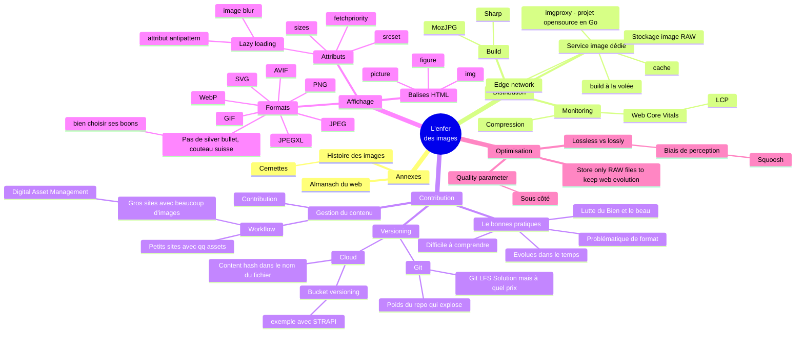

# Mindmap de la conférence : Au secours ! Mes images pourrissent mes perfs

## Structure de la mindmap

### Nœud central
**L'enfer des images** - Le défi global de la gestion des images sur le web

### Notions principales

1. **Distribution des images**
   - Architectures selon le volume (statique, intermédiaire, dynamique)
   - Infrastructure (CDN, cloud, génération)
   - Stratégies de cache

2. **Contribution des images et leur versioning**
   - Versioning (Git LFS, gestion des versions)
   - Gestion du contenu (contribution, workflow)
   - Outils (Git, Git LFS, services dédiés)

3. **L'affichage**
   - Formats d'images (traditionnels, modernes, spécifications)
   - Balises HTML (img, picture, figure)
   - Attributs et techniques (sizes, srcset, responsive)

4. **L'optimisation**
   - Compression (configuration, paramètres)
   - Formats (choix, qualité)
   - Performance (lazy loading, build, automatisation)
   - Métriques (poids, LCP, impact)

### Notions secondaires

- **Architectures par volume** : < 100 assets (statique), ~1000 assets (Git LFS), > 1000 assets (service image)
- **Infrastructure** : CDN, cache, services cloud, génération statique/dynamique
- **Formats modernes** : WebP, AVIF avec leurs spécifications
- **Spécifications HTML** : Balises img, picture, figure et attributs sizes/srcset
- **Techniques d'optimisation** : Compression, lazy loading, build automatisé
- **Performance** : Impact sur le poids des pages (50%+), LCP, métriques
