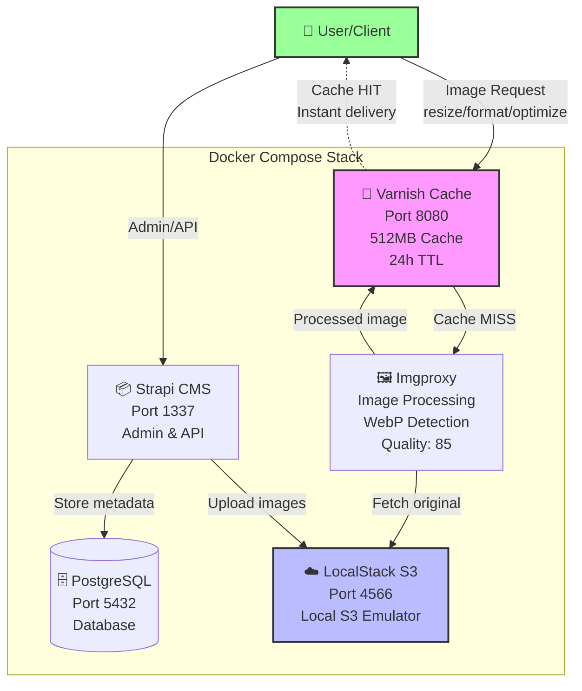

# @talk-images/cms

Strapi CMS for managing Hades wiki scraped images.

## Overview

This package provides a Strapi headless CMS to organize, manage and serve the images scraped from the [Hades Wiki](https://hades.fandom.com/wiki/Hades_Wiki) by the `@talk-images/image-scraper` package.

The CMS runs in Docker containers with PostgreSQL as the database backend, LocalStack S3 for local image storage, imgproxy for on-demand image optimization, and Varnish for caching, providing a fully local development environment for managing game assets.

### Architecture Diagram



### Key Features

- **📝 Content Management**: Strapi headless CMS for organizing images
- **☁️ Local S3 Storage**: LocalStack for local S3-compatible storage
- **🖼️ Image Optimization**: Imgproxy for on-demand resizing, compression, and format conversion
- **⚡ Performance**: Varnish cache for lightning-fast image delivery
- **🗄️ Database**: PostgreSQL for robust data persistence
- **🐳 Docker**: Fully containerized for easy local development

## Prerequisites

- [Docker](https://www.docker.com/get-started) and Docker Compose installed
- [pnpm](https://pnpm.io/) package manager

## Installation

1. Install dependencies:

```bash
pnpm install
```

2. Create a `.env` file from the example:

```bash
cp .env.example .env
```

3. **Important:** Edit `.env` and generate secure random values for secrets in production:

```bash
# Generate random secrets (Linux/macOS)
openssl rand -base64 32
```

Replace the `toBeModified` values in `.env` with generated secrets.

## Usage

### Starting the CMS

Start both PostgreSQL and Strapi containers:

```bash
pnpm docker:up
```

The services will start in the background. Strapi will be available at:

**Via localhost:**
- Admin Panel: http://localhost:1337/admin
- API: http://localhost:1337/api

**Via local domain (OrbStack):**
- Admin Panel: http://strapi-cms.orb.local:1337/admin
- API: http://strapi-cms.orb.local:1337/api

**Via custom domain (Docker for Mac):**
Add to `/etc/hosts`:
```
127.0.0.1 strapi.local
```
Then access via:
- Admin Panel: http://strapi.local:1337/admin
- API: http://strapi.local:1337/api

### First Time Setup

1. After starting the containers, wait for Strapi to initialize (check logs with `pnpm docker:logs`)
2. Navigate to http://localhost:1337/admin
3. Create your first admin user account
4. Start creating content types and managing images!

### Managing the Containers

```bash
# View logs
pnpm docker:logs

# Stop containers
pnpm docker:down

# Restart Strapi container
pnpm docker:restart
```

### Development

For local development without Docker:

```bash
# Install dependencies
pnpm install

# Start in development mode with hot reload
pnpm develop
```

## Available Scripts

- `pnpm develop` - Start Strapi in development mode with hot reload
- `pnpm start` - Start Strapi in production mode
- `pnpm build` - Build the Strapi admin panel
- `pnpm docker:up` - Start Docker containers
- `pnpm docker:down` - Stop Docker containers
- `pnpm docker:logs` - View Strapi container logs
- `pnpm docker:restart` - Restart Strapi container

## Architecture

### Docker Services

The stack consists of 5 containerized services:

**1. PostgreSQL (postgres)**
- **Image**: `postgres:16-alpine`
- **Port**: 5432
- **Purpose**: Database backend for Strapi
- **Persistence**: Docker volume `postgres-data`
- **Health Check**: `pg_isready` every 10s

**2. LocalStack S3 (localstack)**
- **Image**: `localstack/localstack:latest`
- **Port**: 4566
- **Purpose**: Local S3-compatible storage emulator
- **Persistence**: Docker volume `localstack-data`
- **Features**:
  - S3 API compatibility
  - Automatic bucket creation via init script
  - Data persistence across container restarts
  - No cloud credentials required

**3. Strapi CMS (strapi)**
- **Image**: Custom (built from local Dockerfile)
- **Port**: 1337
- **Purpose**: Headless CMS for content and media management
- **Connected to**: PostgreSQL, LocalStack S3
- **Volumes**: Config, src, uploads mounted for live development
- **Features**:
  - Admin panel at `/admin`
  - REST API at `/api`
  - File upload to LocalStack S3
  - CSP configured for S3 image loading

**4. Imgproxy (imgproxy)**
- **Image**: `darthsim/imgproxy:latest`
- **Port**: 8080 (internal only, accessed via Varnish)
- **Purpose**: On-demand image processing and optimization
- **Configuration**:
  - WebP auto-detection enabled
  - Quality: 85
  - Max source resolution: 50MP
  - Gzip compression: level 5
- **Capabilities**:
  - Resize images (`resize:fill:WxH`, `resize:fit:WxH`)
  - Convert formats (WebP, JPEG, PNG)
  - Optimize quality
  - Fetch from LocalStack S3

**5. Varnish Cache (varnish)**
- **Image**: `varnish:stable`
- **Port**: 8080 (exposed to host)
- **Purpose**: HTTP cache layer for processed images
- **Configuration**:
  - Cache size: 512MB RAM
  - TTL: 24 hours
  - Grace period: 1 hour
- **Features**:
  - Cache HIT/MISS headers for debugging
  - Normalized Accept-Encoding for better cache efficiency
  - Cookie removal for pure image caching
  - Serves stale content if imgproxy is down

### Directory Structure

```
packages/cms/
├── config/             # Strapi configuration
│   ├── database.ts     # Database connection config
│   ├── server.ts       # Server settings
│   ├── admin.ts        # Admin panel config (Vite CSP config)
│   ├── middlewares.ts  # Middleware stack (CSP for S3)
│   └── plugins.ts      # Plugin config (S3 upload provider)
├── src/                # Custom code and extensions
│   └── index.ts        # Application entry point
├── database/           # Database files and migrations
├── public/             # Static files and uploads
│   └── uploads/        # Uploaded images (gitignored)
├── localstack-init/    # LocalStack initialization scripts
│   └── init-s3.sh      # Auto-create S3 bucket on startup
├── docker-compose.yml  # Docker orchestration (5 services)
├── Dockerfile          # Strapi container definition
├── default.vcl         # Varnish cache configuration
├── .env                # Environment variables (gitignored)
└── .env.example        # Environment template
```

## Integration with Image Scraper

The images scraped by `@talk-images/image-scraper` can be imported into Strapi for management:

1. **Manual Upload:** Use the Strapi admin panel to upload images
2. **API Import:** Create a script to programmatically import images via the Strapi API
3. **Direct File Access:** Configure Strapi to access the scraper's `images/` directory

## Content Types (To Be Created)

Suggested content type structure for managing scraped images:

### Image
- `filename` (text, required, unique)
- `category` (text, required) - Wiki category name
- `sourceUrl` (text) - Original URL from wiki
- `localPath` (text) - Path in file system
- `tags` (relation) - Custom tags
- `description` (rich text)
- `metadata` (JSON) - Additional data

### Category
- `name` (text, required, unique)
- `description` (text)
- `images` (relation to Image)

## LocalStack S3 Configuration

This CMS uses LocalStack to emulate S3 storage locally, eliminating the need for cloud credentials and making it perfect for demos and local development.

### How It Works

1. **Automatic Setup**: When you start the containers with `pnpm docker:up`, LocalStack automatically:
   - Starts an S3-compatible service on port 4566
   - Runs the initialization script (`localstack-init/init-s3.sh`)
   - Creates the `strapi-assets` bucket
   - Persists data in a Docker volume

2. **No Configuration Required**: The default `.env` file is already configured for LocalStack with test credentials.

### Accessing LocalStack S3

LocalStack S3 is accessible from:
- **Within Docker network**: `http://localstack:4566`
- **From host machine**: `http://localhost:4566`

### S3 Bucket URL Format

Images uploaded to LocalStack are accessible at:
```
http://localhost:4566/strapi-assets/[filename]
```

### Testing LocalStack

You can verify LocalStack is working using the AWS CLI:

```bash
# List buckets
aws --endpoint-url=http://localhost:4566 s3 ls

# List objects in the bucket
aws --endpoint-url=http://localhost:4566 s3 ls s3://strapi-assets/

# Upload a test file
aws --endpoint-url=http://localhost:4566 s3 cp test.png s3://strapi-assets/
```

## Image Processing with Imgproxy

Imgproxy provides on-demand image optimization with caching via Varnish. All processed images are served through port 8080.

### URL Format

```
http://localhost:8080/insecure/[processing_options]/plain/[source_url]
```

### Processing Options

**Resize:**
- `resize:fill:WIDTH:HEIGHT` - Resize and crop to exact dimensions
- `resize:fit:WIDTH:HEIGHT` - Resize to fit within dimensions (no crop)
- `resize:auto:WIDTH:HEIGHT` - Smart resize

**Format Conversion:**
- `format:webp` - Convert to WebP
- `format:jpeg` - Convert to JPEG
- `format:png` - Convert to PNG

**Quality:**
- `quality:N` - Set quality (0-100, default: 85)

### Example URLs

**Original image:**
```
http://localhost:8080/insecure/plain/http://localhost:4566/strapi-assets/Zeus_symbol_0018ce86cc.png
```

**Thumbnail 300x300:**
```
http://localhost:8080/insecure/resize:fill:300:300/plain/http://localhost:4566/strapi-assets/Zeus_symbol_0018ce86cc.png
```

**Responsive image 800px wide, WebP:**
```
http://localhost:8080/insecure/resize:fit:800:0/format:webp/plain/http://localhost:4566/strapi-assets/Zeus_symbol_0018ce86cc.png
```

**High compression for mobile (quality 60, WebP):**
```
http://localhost:8080/insecure/quality:60/format:webp/plain/http://localhost:4566/strapi-assets/Zeus_symbol_0018ce86cc.png
```

**Multiple options combined:**
```
http://localhost:8080/insecure/resize:fill:500:500/quality:70/format:webp/plain/http://localhost:4566/strapi-assets/Zeus_symbol_0018ce86cc.png
```

### Cache Headers

Varnish adds debug headers to help monitor cache performance:

- `X-Cache: HIT` - Image served from cache (fast!)
- `X-Cache: MISS` - Image processed by imgproxy (slower, first request)
- `X-Cache-Hits: N` - Number of times served from cache
- `Age: N` - Seconds since cached

**Check cache status:**
```bash
curl -I "http://localhost:8080/insecure/resize:fill:300:300/plain/http://localhost:4566/strapi-assets/your-image.png"
```

### Performance

- **First request (MISS)**: 1-3 seconds (image processing)
- **Cached requests (HIT)**: < 50ms (served from Varnish)
- **Cache duration**: 24 hours
- **Cache size**: 512MB RAM

## Environment Variables

See `.env.example` for all available environment variables.

**Critical Variables:**
- `APP_KEYS` - Array of keys for session encryption
- `API_TOKEN_SALT` - Salt for API tokens
- `ADMIN_JWT_SECRET` - Secret for admin JWT
- `JWT_SECRET` - Secret for user JWT
- `DATABASE_*` - PostgreSQL connection details

**LocalStack S3 Variables:**
- `AWS_ACCESS_KEY_ID` - Test credentials for LocalStack (default: `test`)
- `AWS_SECRET_ACCESS_KEY` - Test credentials for LocalStack (default: `test`)
- `AWS_REGION` - AWS region (default: `us-east-1`)
- `AWS_ENDPOINT` - LocalStack endpoint URL (default: `http://localstack:4566`)
- `AWS_BUCKET` - S3 bucket name (default: `strapi-assets`)
- `AWS_FORCE_PATH_STYLE` - Use path-style URLs for S3 (required for LocalStack)

**Security Note:** Never commit `.env` to version control. Always use strong random values in production.

## Production Deployment

For production deployment:

1. Set `NODE_ENV=production` in `.env`
2. Generate strong random secrets for all secret variables
3. Run `pnpm build` to build the admin panel
4. Use `pnpm start` instead of `pnpm develop`
5. Configure SSL/TLS termination (nginx reverse proxy recommended)
6. Set up regular PostgreSQL backups
7. Configure proper CORS settings in `config/middlewares.ts`

## Troubleshooting

### Containers won't start
- Check Docker is running
- Verify ports 1337 and 5432 are available
- Check logs: `docker-compose logs`

### Database connection errors
- Ensure PostgreSQL container is healthy: `docker-compose ps`
- Verify database credentials in `.env`
- Check PostgreSQL logs: `docker-compose logs postgres`

### Permission errors
- Ensure `public/uploads` directory exists
- Check Docker volume permissions

## License

MIT
